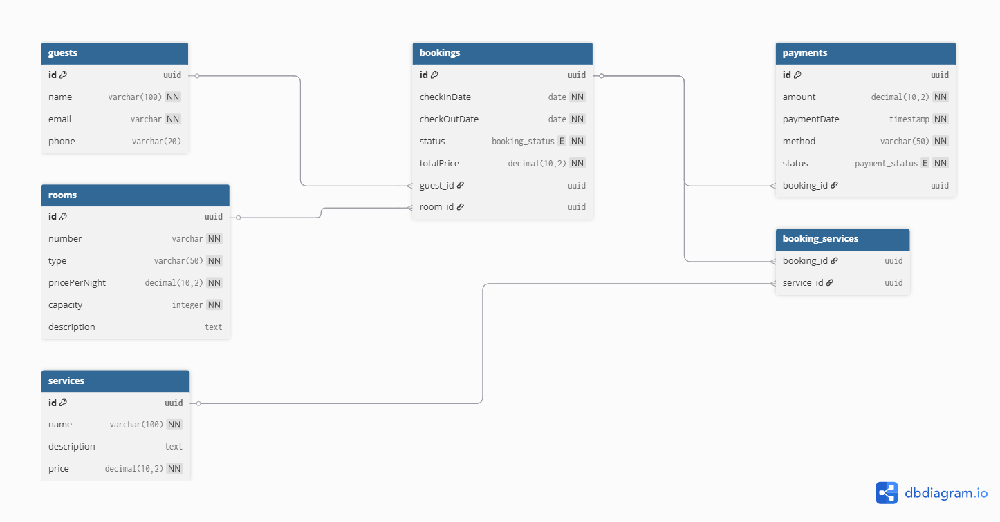

# Hotel Booking System

## Описание предметной области
Система для управления бронированием номеров в отеле. Позволяет регистрировать гостей, управлять номерами, создавать бронирования с возможностью добавления дополнительных услуг и фиксировать оплату.

## Сущности базы данных
- **Guest** (гость) – хранит информацию о постояльцах: имя, email, телефон.
- **Room** (номер) – содержит данные о номерах: номер комнаты, тип, цена за ночь, вместимость, описание.
- **Booking** (бронирование) – основная сущность, связывающая гостя, номер и даты. Включает статус и итоговую стоимость.
- **Payment** (платёж) – информация об оплате бронирования: сумма, дата, способ, статус.
- **Service** (услуга) – дополнительные услуги (завтрак, спа и т.д.), которые можно добавить к бронированию.

## Связи между сущностями
- Один гость может иметь несколько бронирований (One-to-Many).
- Один номер может быть забронирован многократно (но не одновременно) – One-to-Many.
- Одно бронирование может иметь один платёж (One-to-One).
- Одно бронирование может включать несколько услуг, и одна услуга может быть в нескольких бронированиях (Many-to-Many) – реализовано через связующую таблицу `booking_services`.

## ER-диаграмма
